# 👋 Welcome to My Digital Universe

> *"The only ones who fly are the ones who dare to fly"*

<picture><source media="(prefers-color-scheme: dark)" srcset="https://github.com/egecetin/egecetin/raw/main/silhouette-white.png"/>

</picture>

---

## Featured Projects

<table align="center">
<tr>
<td align="center" width="50%">

### 🎥 Video Stabilization
*Real-time environmental shake elimination with enhanced video processing*

`Computer Vision` `Real-time Processing` `Image Enhancement`

</td>
<td align="center" width="50%">

### 🌐 PcapPlusPlus
*High-performance network packet processing library*

`Packet Parsing` `Packet Crafting` `Network Processing`

</td>
</tr>
<tr>
<td align="center" width="50%">

### 🛠️ Repo Initializer
*Modern C++ project template with enterprise-grade integrations*

`Grafana Loki` `Prometheus` `Sentry` `ZeroMQ` `Crashpad` `Telnet`

</td>
<td align="center" width="50%">

### 🔮 libKaleidoscope
*High-performance kaleidoscope effects for real-time applications*

`Real-time Processing` `GPU Acceleration (CUDA)` `Cross-platform`

</td>
</tr>
</table>

---

## 📊 GitHub Analytics

---

## 🌟 Let's Connect & Collaborate

### 💬 Always open to discuss:
`Open Source Collaboration` • `Signal Processing` • `Computer Vision` • `Network Programming` • `Performance Optimization`

---

*"Dream no small dream. It lacks magic. Dream large. Then make the dream real."* - Donald Douglas

